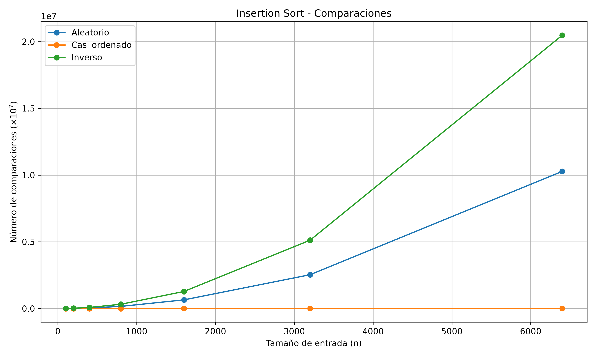
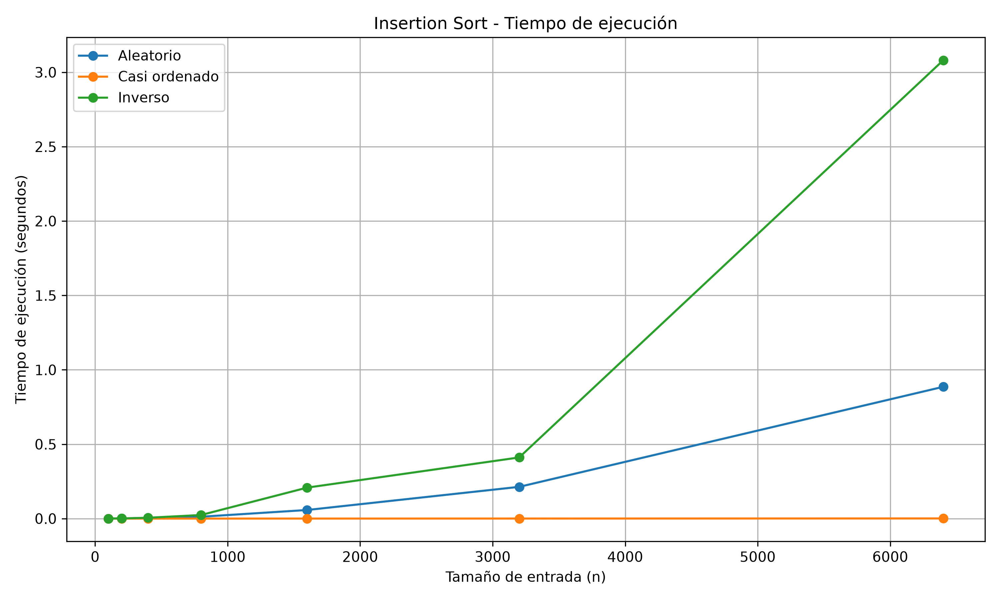
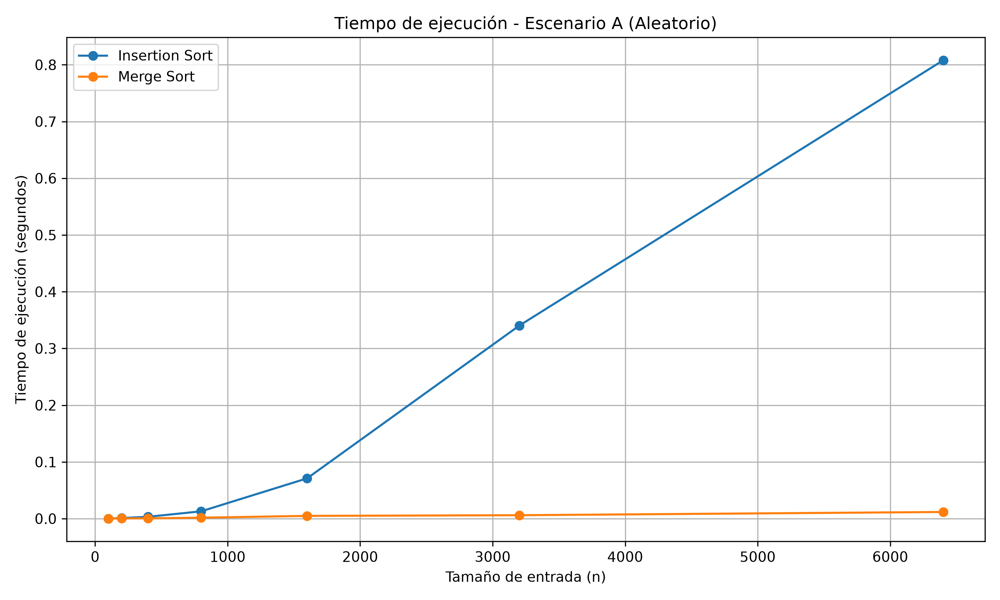

# Laboratorio evaluativo 01 Fundamentos, complejidad y recurrencias

# 1. Punto 1 — [Analizar el algoritmo antes de comprar hardware]

Muchas veces tendemos a confundir hacer algo bien, algo que dio resultados con la forma en la que se realizó, no se puede negar que casi siempre en nuestra ignorancia no cuestionamos nuestros métodos, al contrario, nos montamos en un pedestal creyendo que somo unos genios, pero en realidad nos falta mucho. Eso pasa con los algoritmos, en este ámbito importa mucho mas la eficiencia que la corrección de una lista o en un caso más práctico ordenar expedientes a mano o cualquier clase de documentación. La eficiencia respecto al tiempo importa mucho porque no siempre vamos a tener las mismas entradas a ordenar, no podemos comparar 50 expedientes con 100.000, son cifras completamente distintas y con esa diferencia, puede pasar de que un algoritmo funcione bien a que funcione, pero se tarde por mucho mas tiempo y no cumpla con los requisitos de negocio. La restricción que el sistema de la plataforma temiza mencionado antes es que anteriormente de trabajaban con 20.000 registros en 4 municipios, actualmente el sistema ya no cumple por la expansión del programa que paso de ser 1.200.000, por ello el sistema ya se desborda en la ventana de 4 horas de 2:00am a 6:00am que tiene de procesamiento. Por esta razón no alcanza a ordenar los registros y les toca trabajar con una lista parcial.

Duplicar el servidor podría reducir considerablemente los tiempos de procesamiento, será un efecto placebo muy reconfortante porque aportará procesamiento a un algoritmo que de por sí ya no cumple con la eficiencia respecto al tiempo requerido, puesto que llevan 3 días sin entregar una lista completa ordenada, pero ahí está la trampa, el sistema mejorará y todo, pero cuando haya más registros, si estos se duplican, el trabajo podría aumentar aproximadamente cuatro veces, y si se triplican, hasta nueve veces, haciendo que el sistema vuelva a quedar por fuera del tiempo disponible para procesar los registros diarios. Esta no es una solución viable en todo el sentido de la palabra, en el sentido de la eficiencia energética y también a largo plazo.

Una empresa que trabaja con pedidos necesita organizar los realizados durante el día. Si tiene 50 pedidos, un método poco eficiente puede funcionar de manera correcta y terminar el proceso en poco tiempo respecto a la necesidad de la operación. Sin embargo, si la empresa empieza a crecer y comienza a recibir 100.000 pedidos diarios, el mismo método puede tardar más tiempo o incluso no terminar dentro del tiempo disponible. Aunque el algoritmo siga cumpliendo el objetivo correctamente de los pedidos, deja de ser útil porque no cumple con los tiempos requeridos. En este caso, aumentar la capacidad del servidor podría reducir temporalmente el tiempo de ejecución, pero no solucionaría el problema de fondo si el algoritmo tiene una complejidad elevada. Lo adecuado sería buscar un algoritmo más eficiente que pueda manejar el crecimiento de los datos sin que el tiempo de procesamiento aumente de forma excesiva.

---

# 2. Punto 2 — [Responsabilidad ambiental y ética de la implementación]

El tiempo de ejecución en el proceso nocturno sí afecta mucho y podría aumentar en el futuro, puesto que, al haber cada vez más registros, esto significaría más procesamiento por parte del servidor. Si sumamos el hecho de que no se le va a hacer un análisis detallado al algoritmo empleado para este proceso, porque funciona bien y la única solución más sencilla es sumar capacidad de procesamiento para este proceso, vemos que esto requiere un mayor consumo energético por los nuevos recursos que tiene el servidor y aún más con el aumento de los registros, lo que supone un mayor consumo a largo plazo. Por ello, la forma más viable es atacar el problema de raíz: el algoritmo, y establecer uno mejor.

La primera forma en la que la lentitud o una falla en el sistema podría perjudicar a alguien, alguien que tenga serios problemas cardiovasculares y que los datos se carguen directamente desde el portal web, es decir que estén desordenados los registros. Este caso con un sistema lento perjudicaría mucho a un usuario con alto riesgo, porque en este contexto un/a paciente podría presentar problemas del corazón que pongan en riesgo su vida y el sistema apenas estaría ordenando los registros de acuerdo con el riesgo. El costo lo asumiría el equipo de desarrollo porque son los encargados de automatizar este proceso tan importante en la empresa. La segunda manera es que el sistema no alcance a organizar las pruebas en orden de riesgo y que use esa lista como base para el proceso y que no haya una prioridad a la hora de atender a los pacientes y por lo tanto se descuiden otros pacientes que tienen mas riesgo por el algoritmo tan ineficiente, en este caso el costo lo asumiría la secretaria por la mala metodología que se implementa a la hora de hacer las llamadas.

La obligación adicional aparte del tiempo es la reputación que se puede ganar o perder ya dependiendo del servicio, porque expone la salud de las personas que corren el riesgo de tener problemas del corazón que les pueda costar la vida. Esto no lleva a que el tiempo de procesamiento no es solo un capricho, esto define que perciben por algo que hace un equipo de desarrollo, ejemplo: si yo voy a un ecommerce a realizar una compra online, la pagina le falla de alguna manera, no carga, no procesa la compra, miles de cosas pueden pasar, lo que genera desconfianza entre los usuarios. El criterio del orden importa mucho, no es justo que alguien tenga menos riesgo que otro pueda ser priorizado después de otra persona que no tiene tanto riesgo de perder la vida. Si se contacta primero a alguien que tiene menos riesgo a alguien que tiene bastantes problemas, como consecuencia, sea contactado después. Por lo tanto, la eficiencia es importante para procesar todos los registros dentro del tiempo disponible, pero la corrección es fundamental para garantizar que la priorización sea justa y segura para los pacientes.

---

# 3. Punto 3 — [Peor caso, mejor caso y caso promedio, demostrados en Python]

Codificación de la parte 3 en:

[código de la Parte 3](parte3_casos.py)

Los algoritmos utilizados se encuentran implementados en:

[algoritmos.py](algoritmos.py)

Los datos utilizados para las pruebas se generan mediante:

[datos.py](datos.py)

### 3.1 [Explicación de los 3 casos]

| **Escenario**         | **Canal de origen**                                    | **Cómo llega el lote de registros**                                                                                                                            |
| --------------------- | ------------------------------------------------------ | -------------------------------------------------------------------------------------------------------------------------------------------------------------- |
| **A — Aleatorio**     | Cargue directo desde el portal web de los laboratorios | Los registros quedan en el orden en que cada laboratorio los subió: sin ninguna relación con el índice de riesgo.                                              |
| **B — Casi ordenado** | Reproceso sobre la lista del día anterior              | El 98 % del lote es la lista de ayer, que ya quedó ordenada por riesgo; el 2 % restante son los resultados nuevos del día, que se anexan al final sin ordenar. |
| **C — Orden inverso** | Migración desde el sistema legado de historia clínica  | El sistema anterior exporta los registros del índice de riesgo **menor al mayor**, es decir, exactamente al revés de lo que Tamiza necesita.                   |

Cuando hablamos de algoritmos siempre ahí que estimar de que base partimos para el desarrollo de una tarea, esto nos condiciona a que dependamos de una base sobre la cual se debe trabajar. Así mismo definimos 3 posibilidades cuando se trata de ordenamiento de un que hace un algoritmo siempre el peor caso va a ser el que esta en orden inverso, puesto que le toca mover casi todos y ordenarlos, si es un caso promedio el cual esta de forma aleatoria, no va a estar inverso si no que solo va a estar menos ordenado, si esta casi ordenado, va a tomar menos tiempo porque no va haber la necesidad de ordenar tanto.

Para decidir si el algoritmo de Tamiza puede entrar en producción, utilizaría principalmente el peor caso, debido a que la ventana de cuatro horas es estricta. Aunque el algoritmo pueda funcionar rápidamente en la mayoría de las situaciones, debe garantizar que incluso ante la entrada que genere el mayor costo pueda procesar el lote dentro del tiempo disponible. El caso promedio también se podria utilizar para conocer el comportamiento habitual del sistema pero no garantiza que el algoritmo pueda evidenciar que no supere la ventana tan estricta de 4 horas, como si se podria tener en cuenta en el orden inverso(peor caso).

Para Insertion Sort, mi predicción antes de realizar las mediciones es:
| Escenario             | Situación de los datos                                                 | Predicción        |
| --------------------- | ---------------------------------------------------------------------- | ----------------- |
| **A — Aleatorio**     | Registros sin un orden determinado                                     | **Caso promedio** |
| **B — Casi ordenado** | 98 % ordenado y 2 % nuevo al final                                     | **Mejor caso**    |
| **C — Orden inverso** | Registros ordenados de menor a mayor, cuando se necesita mayor a menor | **Peor caso**     |

### 3.2 [Demostración experimental]

Se ejecutó `insertion_sort` para los tres escenarios y diferentes tamaños de entrada, registrando el número de comparaciones y el tiempo de ejecución.

#### Comparaciones



#### Tiempo de ejecución



En contraste con lo explicado acerca de los tres casos, se había predicho el peor caso, el caso promedio y el mejor caso. Se acertó, puesto que el número de comparaciones ya estaba estimado según la teoría y se pudo demostrar en la práctica.

### Resultados de comparaciones

| Tamaño de entrada (n) |  Aleatorio | Casi ordenado |    Inverso |
| --------------------: | ---------: | ------------: | ---------: |
|                   100 |      2.542 |           100 |      4.950 |
|                   200 |      9.970 |           203 |     19.900 |
|                   400 |     40.436 |           417 |     79.800 |
|                   800 |    160.484 |           866 |    319.600 |
|                 1.600 |    648.481 |         1.851 |  1.279.200 |
|                 3.200 |  2.533.103 |         4.172 |  5.118.400 |
|                 6.400 | 10.276.753 |        10.277 | 20.476.800 |

---

# 4. Punto 4 — [Complejidad de merge sort e insertion sort: cálculo y validación]

## Parte 4 — Medición de tiempos

Codigo de la parte 4 en:

[código de la Parte 4](parte4_tiempo.py)

Los algoritmos utilizados son los implementados en:

[algoritmos.py](algoritmos.py)

Los datos de prueba se generan mediante:

[datos.py](datos.py)

## 4.1 — Cálculo teórico

## 1. Recurrencia de Merge Sort

Merge Sort divide el conjunto de `n` elementos en dos subproblemas de tamaño `n/2`. Después de ordenar recursivamente cada mitad, realiza el proceso de combinación (*merge*).

La recurrencia es:

```text
T(n) = 2T(n/2) + Θ(n)
```

### ¿De dónde sale cada término?

* `2`: se generan **dos subproblemas**.
* `T(n/2)`: cada subproblema contiene aproximadamente la mitad de los elementos.
* `Θ(n)`: corresponde al costo de combinar las dos partes ordenadas. Para realizar el `merge` es necesario recorrer los elementos de ambas partes.

La estructura de la recurrencia puede representarse así:

```text
                         T(n)
                       /      \
                  T(n/2)    T(n/2)
                  /   \      /   \
             T(n/4) T(n/4) T(n/4) T(n/4)
                ...
```

---

## 2. Resolución mediante el Método Maestro

La forma general del Teorema Maestro es:

```text
T(n) = aT(n/b) + f(n)
```

Comparando con:

```text
T(n) = 2T(n/2) + Θ(n)
```

se obtiene:

```text
a = 2
b = 2
f(n) = Θ(n)
```

Ahora calculamos:

```text
n^(log_b(a))
```

Sustituyendo:

```text
n^(log₂(2))
```

Como:

```text
log₂(2) = 1
```

entonces:

```text
n^(log₂(2)) = n
```

Por lo tanto:

```text
f(n) = Θ(n)
```

y:

```text
n^(log_b(a)) = Θ(n)
```

Ambas expresiones tienen el mismo orden:

```text
f(n) = Θ(n^(log_b(a)))
```

Esto corresponde al **caso 2 del Teorema Maestro**.

Por el caso 2:

```text
T(n) = Θ(n^(log_b(a)) log n)
```

Sustituyendo:

```text
T(n) = Θ(n¹ log n)
```

Por lo tanto:

```text
┌─────────────────────────┐
│ T(n) = Θ(n log n)       │
└─────────────────────────┘
```

---

## 3. Aplicación al problema de Tamiza

El lote contiene:

```text
n = 1.200.000 registros
```

Para Merge Sort:

```text
T(n) = Θ(n log n)
```

Tomando logaritmo en base 2:

```text
log₂(1.200.000) ≈ 20,19
```

Entonces:

```text
n log₂(n) ≈ 1.200.000 × 20,19
```

```text
≈ 24.228.000
```

Este valor representa una magnitud aproximada del trabajo asociado al crecimiento `n log n`. No corresponde directamente a segundos ni a un número exacto de instrucciones, ya que depende de la implementación y del hardware.

---

## 4. Complejidad de Insertion Sort

Una implementación típica de Insertion Sort es:

```text
for j = 2 hasta n
    clave = A[j]
    i = j - 1

    while i > 0 y A[i] > clave
        A[i + 1] = A[i]
        i = i - 1

    A[i + 1] = clave
```

En el peor caso, los elementos están ordenados de manera inversa.

Por ejemplo:

```text
[8, 7, 6, 5, 4, 3, 2, 1]
```

Para cada elemento se deben realizar desplazamientos:

```text
1 + 2 + 3 + ... + (n - 1)
```

La suma es:

```text
n(n - 1) / 2
```

Para `n = 1.200.000`:

```text
1.200.000 × 1.199.999
---------------------
          2
```

```text
= 719.999.400.000
```

Por lo tanto, el peor caso de Insertion Sort es:

```text
T(n) = Θ(n²)
```

---

## 5. Comparación de complejidades

| Algoritmo      | Mejor caso | Caso promedio |  Peor caso |
| -------------- | ---------: | ------------: | ---------: |
| Insertion Sort |       Θ(n) |         Θ(n²) |      Θ(n²) |
| Merge Sort     | Θ(n log n) |    Θ(n log n) | Θ(n log n) |

### Escenarios del problema

**Escenario A — Aleatorio**

Insertion Sort presenta un comportamiento promedio:

```text
Θ(n²)
```

Merge Sort:

```text
Θ(n log n)
```

**Escenario B — Casi ordenado**

Insertion Sort puede acercarse a:

```text
Θ(n)
```

si la cantidad de elementos fuera de posición es pequeña.

Merge Sort mantiene:

```text
Θ(n log n)
```

**Escenario C — Orden inverso**

Insertion Sort alcanza su peor caso:

```text
Θ(n²)
```

Merge Sort mantiene:

```text
Θ(n log n)
```

---

## 6. Conclusión

Para el lote de `1.200.000` registros, Merge Sort presenta una complejidad:

```text
Θ(n log n)
```

mientras que Insertion Sort presenta en el peor caso:

```text
Θ(n²)
```

Por lo tanto, el crecimiento del costo de Insertion Sort es mucho mayor cuando aumenta el número de registros. Duplicar la capacidad del servidor puede reducir el tiempo de ejecución por un factor constante, pero no cambia la complejidad asintótica del algoritmo.

El cambio de:

```text
Insertion Sort → Merge Sort
```

permite pasar de un crecimiento cuadrático a un crecimiento:

```text
Θ(n log n)
```

que resulta más adecuado para procesar grandes cantidades de registros.


## 4.2 [Validación experimental]

## Gráfica de tiempos de ejecución



### Conclusión

A medida que aumenta el tamaño de entrada, el tiempo de ejecución de Insertion Sort aumenta más rápidamente que el de Merge Sort. En la gráfica
se observa que Merge Sort mantiene un crecimiento menor para los tamaños evaluados.

Esto coincide con las complejidades calculadas en la sección 4.1: Insertion Sort tiene una complejidad promedio de Θ(n²), mientras que Merge Sort tiene una complejidad de Θ(n log n).

Para tamaños pequeños las diferencias pueden ser menos evidentes e incluso puede ocurrir que los tiempos sean similares debido al costo adicional de las llamadas recursivas de Merge Sort y a factores propios del hardware y del entorno de ejecución.

Tambien coincide con lo mostrado en la grafica, mientras que la curva de Merge sort se ve mucho mas horizontal, la de Insertion sort se eleva mucho al mostrar el tiempo empleado para dicho algoritmo. Lo que evidencia que el Merge sort funciona mucho mejor en cuanto a rendimiento cuando se trata de un algoritmo.

## 4.3 [Concepto técnico a la Secretaría de Salud]

## Concepto técnico

### Recomendación

Se recomienda utilizar **Merge Sort** como algoritmo de ordenamiento para Tamiza.

La decisión se basa tanto en el análisis teórico como en las mediciones realizadas. En la prueba con `n = 6.400` registros, Insertion Sort tardó `0,633972 s`, mientras que Merge Sort tardó `0,010626 s`.


Además, el canal de entrada puede cambiar sin aviso. Insertion Sort puede presentar un buen comportamiento cuando los datos están casi ordenados, pero puede llegar a `Θ(n²)` cuando los registros están en orden inverso. Merge Sort mantiene un comportamiento de `Θ(n log n)` independientemente del orden inicial de los datos.

Por esta razón, se recomienda mantener una única implementación de Merge Sort para los diferentes escenarios de entrada.

### Estimación para 1.200.000 registros

Las pruebas realizadas llegaron hasta `6.400` registros. Por lo tanto, los resultados para `1.200.000` registros son una **estimación por extrapolación y no una medición directa**.

Para Insertion Sort se utilizó el crecimiento cuadrático:

```text
T(1.200.000) ≈ T(6.400) × (1.200.000 / 6.400)²
```

Utilizando el tiempo medido:

```text
T(1.200.000) ≈ 0,633972 × (1.200.000 / 6.400)²
```

```text
T(1.200.000) ≈ 22.288,08 segundos
```

Esto equivale aproximadamente a:

```text
6,19 horas
```

La estimación supera la ventana disponible de cuatro horas, que corresponde a `14.400 segundos`.

Para Merge Sort se utilizó el crecimiento `n log n`:

```text
T(1.200.000) ≈ T(6.400) ×
(1.200.000 × log₂(1.200.000)) /
(6.400 × log₂(6.400))
```

Utilizando el tiempo medido de `0,010626 s`:

```text
T(1.200.000) ≈ 3,18 segundos
```

Este resultado también es una **estimación**, no una medición directa. De acuerdo con esta extrapolación, Merge Sort estaría dentro de la ventana de cuatro horas.

### Evaluación de la propuesta de duplicar la velocidad del servidor

Los resultados medidos muestran que con `6.400` registros Insertion Sort tardó `0,633972 s`, mientras que Merge Sort tardó `0,010626 s`. Estos valores corresponden a las mediciones utilizadas para construir la gráfica `parte4_tiempo.png`.

Duplicar la velocidad del servidor podría reducir el tiempo de ejecución, pero no cambiaría la complejidad de Insertion Sort, que seguiría siendo `Θ(n²)`.

Además, la extrapolación realizada a partir de la medición de `6.400` registros estima aproximadamente `6,19 horas` para Insertion Sort con `1.200.000` registros, superando la ventana disponible.

Por lo tanto, la solución recomendada es cambiar el algoritmo de ordenamiento a Merge Sort en lugar de depender únicamente de un aumento de capacidad del servidor.

### Consideraciones adicionales

Merge Sort requiere memoria adicional para realizar la combinación de las listas, mientras que Insertion Sort puede trabajar con un consumo adicional de memoria menor.

Sin embargo, Tamiza debe procesar `1.200.000` registros y el orden de llegada puede cambiar sin aviso. Depender de que los datos permanezcan casi ordenados representa un riesgo, ya que un cambio en el flujo de reproceso podría hacer que Insertion Sort tenga un comportamiento considerablemente peor.

Merge Sort permite mantener una única implementación y ofrece un comportamiento más consistente frente a los diferentes órdenes de entrada.

---

## Tecnologías utilizadas

* Python 3
* Git y GitHub
* `time.perf_counter()` para medición de tiempos
* Matplotlib para la generación de gráficas

## Requisitos

* Python 3.13
* Git
* Matplotlib

## Autores

* [Jhon Fernando Sánchez Álvarez]